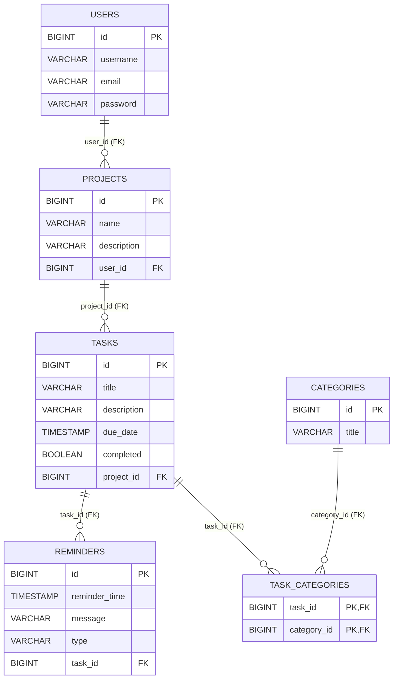

# ER Diagram

```mermaid
erDiagram
    USERS ||--o{ PROJECTS : "user_id (FK)"
    PROJECTS ||--o{ TASKS : "project_id (FK)"
    TASKS ||--o{ REMINDERS : "task_id (FK)"
    TASKS ||--o{ TASK_CATEGORIES : "task_id (FK)"
    CATEGORIES ||--o{ TASK_CATEGORIES : "category_id (FK)"

    USERS {
        BIGINT id PK
        VARCHAR username
        VARCHAR email
        VARCHAR password
    }

    PROJECTS {
        BIGINT id PK
        VARCHAR name
        VARCHAR description
        BIGINT user_id FK
    }

    TASKS {
        BIGINT id PK
        VARCHAR title
        VARCHAR description
        TIMESTAMP due_date
        BOOLEAN completed
        BIGINT project_id FK
    }

    REMINDERS {
        BIGINT id PK
        TIMESTAMP reminder_time
        VARCHAR message
        VARCHAR type
        BIGINT task_id FK
    }

    CATEGORIES {
        BIGINT id PK
        VARCHAR title
    }

    TASK_CATEGORIES {
        BIGINT task_id PK, FK
        BIGINT category_id PK, FK
    }
```
